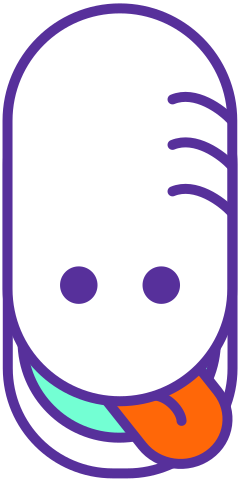

# **Welcome to Hoagie Club** 👋

  

   

  
  

---

## 🎯 **Our Mission**

> **Build premier web applications and push the boundaries of what's possible.**

We are building a cohesive software suite with the goal of empowering Princeton students with all the tools they would ever need during their time here.

## 🥖 **About Us**

We are a dedicated team of passionate student developers, designers, and product managers aspiring to build the most impactful applications for Princeton students. With cohesive product designs and a clear brand direction, we strive to create a premier digital experience for the Princeton community.

Our ideals are built upon the following pillars:

### **Shipping** 🚢

With a flat hierarchy and a culture focused on moving fast and shipping, we empower our developers to take ownership and make impactful decisions. We believe in moving quickly and efficiently to turn ideas into reality.

### **Innovation** 🚀

We stay at the bleeding edge of technologies and consider ourselves extremely early adopters of paradigm-shifting tech that shows real promise. We thoughtfully evaluate emerging tools and frameworks, betting on those that will revolutionize how we build.

### **Timeless** ⏳

We invest a considerable amount of time designing our codebases to be **highly maintainable**. In addition to writing super clean and sanitized code, we want to build lasting software that future Princeton developers can easily dive into, understand, and start shipping meaningful features from day one.

### **Education** 📚

We believe in **learning by doing** and seek to nurture a culture of **voracious** documentation reading. Being able to expertly navigate through documentation is an invaluable skill. We want to help our team members grow and excel in their craft and be well-prepared to build amazing projects long after their time here at Princeton.

### **Excellence** 💎

If you have an insatisable hunger for learning and you're driven to become a 10x developer, **we want to hear from you**. Through mentorship and challenging projects, we forge exceptional software engineers who are excited to ship high-quality code.

Compelled by our mission? Visit our [website](https://club.hoagie.io) and apply to become a Hoagie Developer. We're always on the lookout for talented, team-oriented developers unhindered by ego and eager to learn what shipping impactful software looks like.

## 🌟 **Featured Projects**

## 💻 **Technology Stack**

We put a lot of time and thought into our tooling and build with **industry-standard technologies** because we believe in setting up our developers for success in their future careers:

### **Project Management**

### **Languages & Runtimes**

### **Frameworks**

### **Why These Choices?**

- **TypeScript**: Our foundation for frontend development. While JavaScript is an inseparable component from the modern internet, we emphasize type safety as a first-class concern to catch errors before they happen, to enhance code quality/correctness, and to provide an unmatched developer experience with exceptional IDE support. It has become the industry standard for a reason, and we are staunch believers. Additionally, JavaScript is taught in courses like COS 333 and COS 426, so students will already have a headstart with adopting TypeScript.

- **Python**: Perfect for rapid prototyping and backend development. Its rich ecosystem enables quick iteration while maintaining readability. Python's dominance in machine learning through PyTorch makes it essential for AI-driven features. Further, Python is taught at Princeton through courses like COS 324 and COS 333, and we believe that every developer should be comfortable with Python.

- **Go**: Our choice for high-performance, distributed systems. When we need raw speed and rock-solid reliability, Go delivers. Its simplicity and excellent standard library make it ideal for building scalable services that just work. Similar to Python, Go is also taught at Princeton through courses like COS 316 and COS 418.

- **Next.js**: **The crown jewel of React development**, its hybrid rendering strategies, excellent DX, and built-in performance optimizations make it our go-to frontend framework. The static and server-side rendering capabilities ensure our apps are both fast and SEO-friendly.

- **Django**: Battle-tested web framework with a powerful ORM and admin interface. Its "batteries-included" philosophy and security features allow us to move quickly while maintaining industry-grade reliability.

- **Gin**: Our high-performance API framework. When milliseconds matter, Gin's zero-allocation router and lightning-fast middleware make it the perfect choice for building high-throughput services like [HoagieMail](https://mail.hoagie.io).

- **Bun**: A blazing-fast all-in-one JavaScript runtime and toolkit built with . Bun is **30x faster than other Node.js alternatives** with native bundling, testing, and package management.

- **uv**: An Python package manager and toolkit written by Princeton alumnus [Charlie Marsh '15](https://www.linkedin.com/in/marshcharles), built with . uv is **10-100x faster than pip** with improved dependency resolution.

- **Ruff**: A fast and efficient Python linter built with  that helps maintain code quality by enforcing consistent style and catching potential bugs early.

- **Slack**: Our primary communication tool that keeps everyone connected and informed. With organized channels and integrations, it ensures seamless collaboration across the team.

- **Linear**: Keeps our development process streamlined and focused. Its opinionated and keyboard-driven workflow aligns perfectly with how we think about project management—fast and always in sync with our code.

## 📊 **Organization Statistics**

### **Club Activity**

### **Main Projects**

| Repository | Stars | Issues | Pull Requests |
|------------|-------|--------|---------------|
| [Plan](https://github.com/HoagieClub/plan) |  |  |  |
| [Mail](https://github.com/HoagieClub/mail) |  |  |  |
| [Meal](https://github.com/HoagieClub/meal) |  |  |  |
| [Stuff](https://github.com/HoagieClub/stuff) |  |  |  |
| [Queue](https://github.com/HoagieClub/queue) |  |  |  |

### **Club Infrastructure**

| Repository | Stars | Issues | Pull Requests |
|------------|-------|--------|---------------|
| [Template](https://github.com/HoagieClub/template) |  |  |  |
| [Docs](https://github.com/HoagieClub/docs) |  |  |  |
| [Club](https://github.com/HoagieClub/club) |  |  |  |

## 🤝 **Contributing**

Think you've got what it takes? You have our attention!

1. **Choose A Problem**: Pick an issue/bug that you're itching to solve.
2. **Show Your Skills**: Fork the repo and submit a thoughtfully crafted PR.
3. **Join The Discussion**: Engage with our team and show us how you think.

## 📫 **Connect With Us**

## 📄 **License**

Our projects are licensed under the [MIT license](../LICENSE), always and forever. We believe in the power of open-source software and hope that our code can serve as exemplars for developers at Princeton.

## 🎉 **Acknowledgments**

Special thanks to our incredible team of developers, past and present, who've helped make Hoagie Club what it is today.

---

  Made with ❤️ by Hoagie Club
   
  © 2024 Hoagie Club. All rights reserved.

---
